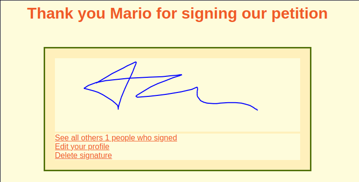

# petition

Web app with NodeJs/Express, PostgreSQL and Handlebars as templates. Users are allowed to register, add personal information and sign a mock petition.
The signature is saved to the database from [Canva API](https://developer.mozilla.org/en-US/docs/Web/API/Canvas_API).

To start the project after cloning.

```sh
$ npm install
$ node index.js
```
It is also needed to *createdb* with postgres and create tables as the examples given in `./sql/` directory.

```sh
$ createdb petition
[user@user sql]$ psql -d petition -f user_profiles.sql
```

